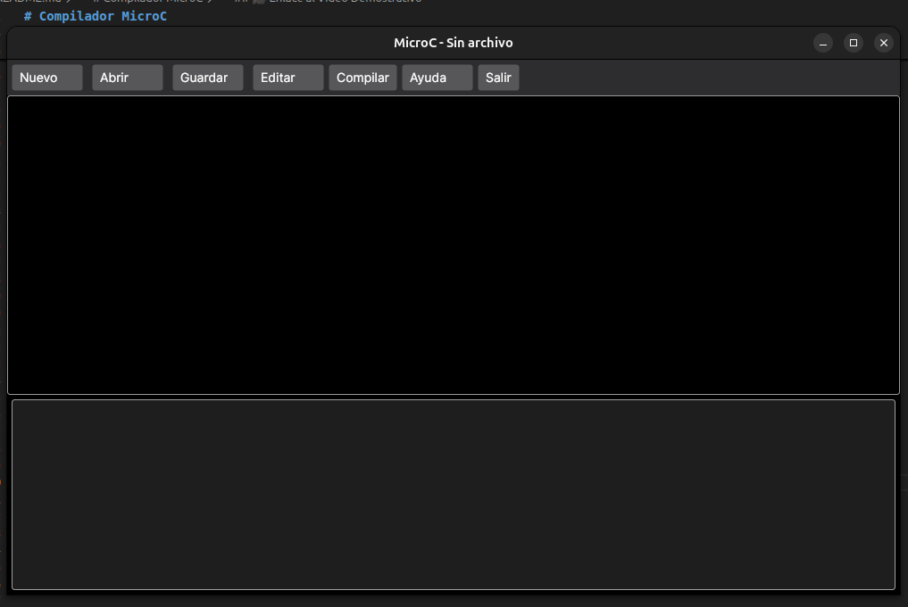

# Compilador MicroC

## 📌 Portada

**Nombre completo:** Ángel Hernández\
**Número de carné:** COLOCAR_AQUI_TU_CARNE\
**Curso:** Autómatas y Lenguajes\
**Proyecto:** Compilador MicroC

------------------------------------------------------------------------

## 📖 Descripción del Proyecto

MicroC es un pre-compilador desarrollado como proyecto del curso de
Autómatas y Lenguajes de la Universidad Mesoamericana.

El objetivo principal del proyecto es simular el funcionamiento básico
de un compilador para el lenguaje C, permitiendo al usuario escribir
código, guardarlo, abrir archivos existentes y verificar errores
sintácticos simples.

El sistema analiza el código ingresado y valida:

-   Existencia de la función principal `int main()`
-   Correcto uso de llaves `{ }`
-   Presencia de punto y coma `;`
-   Estructura básica del programa

También incluye control de edición, confirmación de salida con cambios
sin guardar y ventana de ayuda integrada.

------------------------------------------------------------------------

## 🛠 Tecnologías Utilizadas

-   Lenguaje: C#
-   Framework: .NET 8
-   Interfaz gráfica: Avalonia UI
-   Control de versiones: Git y GitHub
-   Sistema operativo de desarrollo: Linux

------------------------------------------------------------------------

## ▶ Instrucciones de Ejecución

### 🔹 Ejecutar desde el código fuente

1.  Abrir una terminal dentro de la carpeta del proyecto.
2.  Ejecutar el siguiente comando:

```{=html}
<!-- -->
```
    dotnet run

------------------------------------------------------------------------

### 🔹 Ejecutar versión compilada (Release)

1.  Navegar a la carpeta:

```{=html}
<!-- -->
```
    bin/Release/net8.0/linux-x64/publish/

2.  Ejecutar:

```{=html}
<!-- -->
```
    ./MicroC

También puede ejecutarse desde el acceso directo creado en el escritorio
(si aplica).

------------------------------------------------------------------------

## 🖼 Capturas de Pantalla

En esta sección deben incluirse imágenes de:

-   Interfaz principal del programa
-   Ejemplo de compilación exitosa
-   Ejemplo de error detectado
-   Ventana de ayuda

Ejemplo de inserción de imagen en Markdown:

    

Las imágenes deben almacenarse en la carpeta `/docs/` o `/assets/` según
la estructura solicitada.

------------------------------------------------------------------------

## 🎥 Enlace al Video Demostrativo

El video demostrativo muestra:

-   Creación de archivo nuevo
-   Edición de código
-   Guardado de archivo
-   Proceso de compilación
-   Detección de errores
-   Funcionamiento del botón Ayuda

🔗 Enlace al video: COLOCAR_AQUI_EL_LINK_DEL_VIDEO

------------------------------------------------------------------------

## 📂 Estructura del Repositorio

El repositorio está organizado de la siguiente manera:

    /src/        → Código fuente de la aplicación
    /assets/     → Recursos como imágenes o íconos
    /docs/       → Documentación y capturas de pantalla
    /test/       → (Opcional) Archivos de prueba
    README.md    → Documentación principal del proyecto

------------------------------------------------------------------------

## 🚀 Versión Final

Se publicó un Release final en GitHub con el tag:

v1.0-precompilador

Esta versión contiene el código funcional completo del pre-compilador
MicroC.