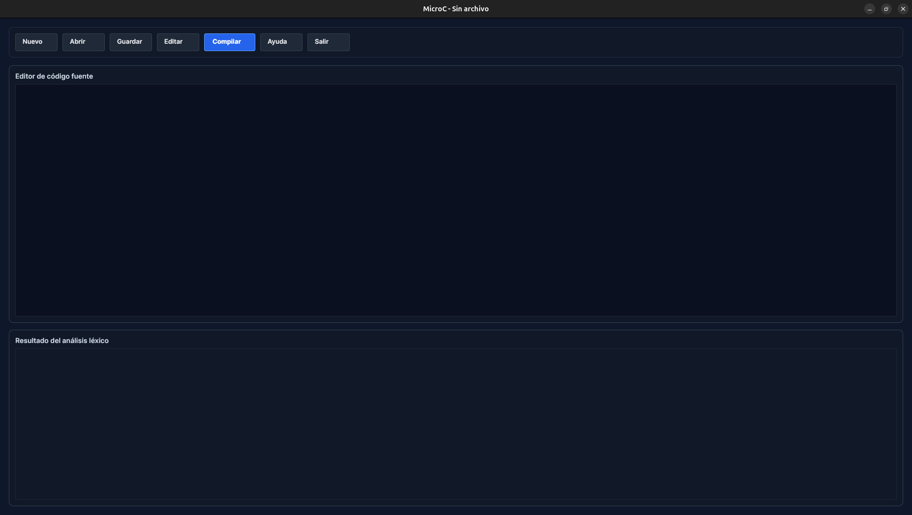
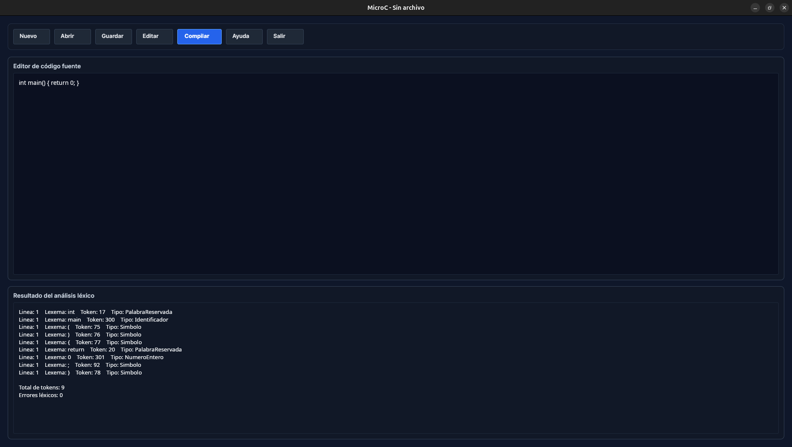
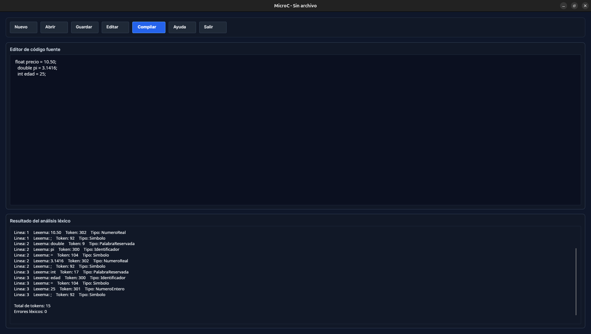
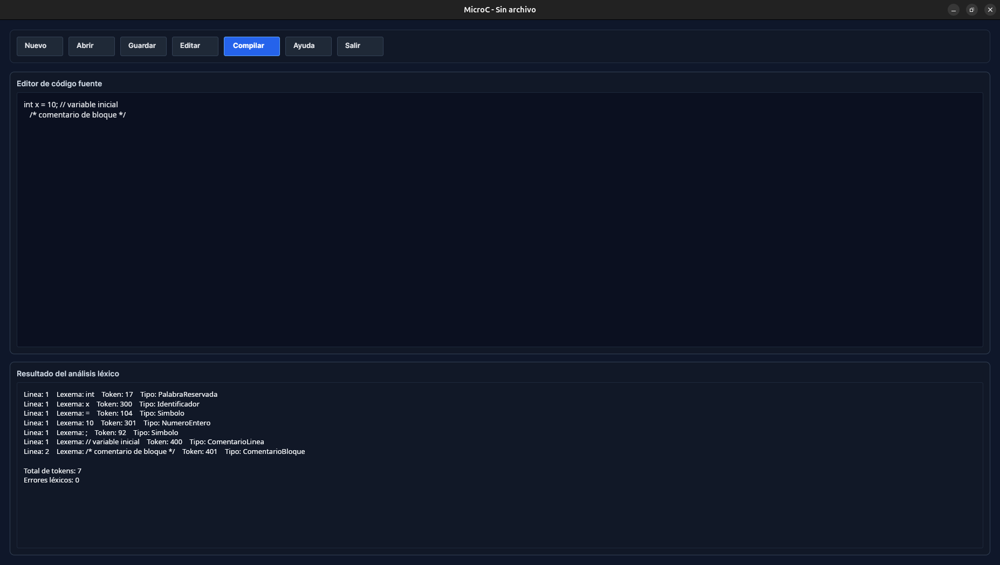
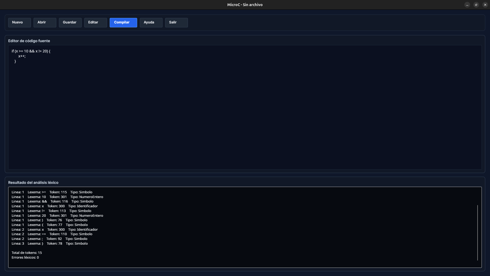
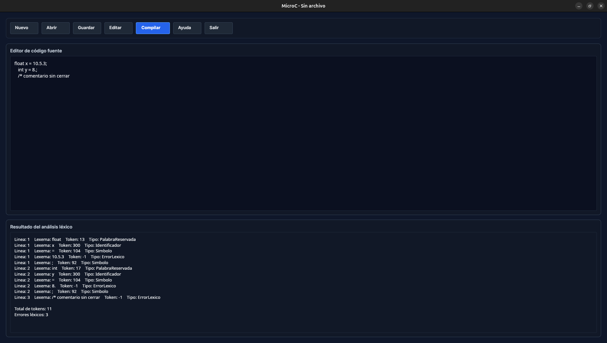

# Compilador MicroC

## 📌 Portada 

**Nombre completo:** Angel Hernández\
**Número de carné:** 202425514\
**Curso:** Autómatas y Lenguajes\
**Proyecto:** Compilador MicroC

------------------------------------------------------------------------

## 📖 Descripción del Proyecto

MicroC es un pre-compilador desarrollado en Avalonia .NET como proyecto
del curso de Autómatas y Lenguajes de la Universidad Mesoamericana.

El objetivo principal del proyecto es simular el funcionamiento básico
de un compilador para el lenguaje C. Actualmente implementa la Fase I y
la Fase II del analizador léxico, permitiendo al usuario escribir
código, abrir archivos existentes, guardar archivos y ejecutar el
análisis léxico.

El sistema analiza el código ingresado y realiza:

-   Generación de lista de tokens
-   Identificación de lexemas simples y palabras reservadas
-   Diferenciación entre números enteros y números reales
-   Reconocimiento de comentarios de línea y comentarios de bloque
-   Reconocimiento de operadores compuestos
-   Relación de lexemas con su número de línea
-   Ignorar espacios en blanco, tabuladores y saltos de línea
-   Detección básica de errores léxicos

También incluye control de edición, confirmación de salida con cambios
sin guardar y ventana de ayuda integrada.

------------------------------------------------------------------------

## 🔎 Fase I — Analizador Léxico

La Fase I del proyecto procesa el código fuente carácter por carácter
para separar lexemas y clasificar cada token según su tipo. El resultado
del análisis registra la línea, el lexema encontrado, el número de token
y el tipo correspondiente.

Además, el sistema muestra el total de tokens generados y la cantidad de
errores léxicos detectados durante el recorrido del código fuente.

### Clases agregadas

-   `TokenLexico.cs`: representa cada token con los campos `Linea`,
    `Lexema`, `Token` y `Tipo`.
-   `UnidadesLexicas.cs`: contiene la tabla de símbolos y tokens
    reconocidos por el analizador.
-   `AnalizadorLexico.cs`: realiza el recorrido del código fuente y
    genera la lista de tokens.

### Tokens implementados

| Lexema | Token | Tipo |
|---|---:|---|
| ( | 75 | Símbolo |
| ) | 76 | Símbolo |
| { | 77 | Símbolo |
| } | 78 | Símbolo |
| [ | 79 | Símbolo |
| ] | 80 | Símbolo |
| , | 91 | Símbolo |
| ; | 92 | Símbolo |
| . | 93 | Símbolo |
| + | 100 | Símbolo |
| - | 101 | Símbolo |
| * | 102 | Símbolo |
| / | 103 | Símbolo |
| = | 104 | Símbolo |
| < | 105 | Símbolo |
| > | 106 | Símbolo |
| ! | 107 | Símbolo |
| & | 108 | Símbolo |
| \| | 109 | Símbolo |
| Identificador | 300 | Identificador |
| Número entero | 301 | NumeroEntero |
| Número real | 302 | NumeroReal |
| Error léxico | -1 | ErrorLexico |

### Ejemplo de análisis léxico

```c
int main() {
    int x = 10;
    x = x + 1;
}
```

Salida resumida:

```text
Linea: 1    Lexema: int     Token: 17     Tipo: PalabraReservada
Linea: 1    Lexema: main    Token: 300    Tipo: Identificador
Linea: 1    Lexema: (       Token: 75     Tipo: Simbolo
Linea: 1    Lexema: )       Token: 76     Tipo: Simbolo
Linea: 1    Lexema: {       Token: 77     Tipo: Simbolo
...
Total de tokens: 17
Errores léxicos: 0
```

------------------------------------------------------------------------

## 🧩 Fase II — Analizador Léxico Completo

La Fase II completa el análisis léxico básico del proyecto. En esta
etapa, el analizador ya no clasifica todas las palabras como
identificadores, sino que consulta una tabla de palabras reservadas y
asigna el token correspondiente cuando el lexema pertenece al lenguaje C
o a palabras comunes de C/C++.

También se agregó el reconocimiento de números enteros y reales,
comentarios, operadores compuestos y errores léxicos más específicos.

### Palabras reservadas implementadas

El analizador reconoce las palabras reservadas principales de C:

`auto`, `break`, `case`, `char`, `const`, `continue`, `default`, `do`,
`double`, `else`, `enum`, `extern`, `float`, `for`, `goto`, `if`, `int`,
`long`, `register`, `return`, `short`, `signed`, `sizeof`, `static`,
`struct`, `switch`, `typedef`, `union`, `unsigned`, `void`, `volatile` y
`while`.

Además, se agregaron palabras comunes de C/C++:

`include`, `define`, `using`, `namespace`, `class`, `public`, `private`,
`protected`, `new`, `delete`, `true`, `false`, `cout`, `cin` y `endl`.

### Números enteros y reales

Los números enteros se registran con token `301` y tipo `NumeroEntero`.
Los números reales se registran con token `302` y tipo `NumeroReal`,
siempre que tengan un solo punto decimal y al menos un dígito después
del punto.

Ejemplos válidos:

-   `10`
-   `25`
-   `3.14`
-   `0.5`
-   `100.00`

### Comentarios

Los comentarios de línea inician con `//` y se leen hasta antes del
salto de línea. Se registran con token `400` y tipo
`ComentarioLinea`.

Los comentarios de bloque inician con `/*` y terminan con `*/`. Pueden
abarcar varias líneas y se registran con token `401` y tipo
`ComentarioBloque`.

### Operadores compuestos

| Lexema | Token | Tipo |
|---|---:|---|
| ++ | 110 | Simbolo |
| -- | 111 | Simbolo |
| == | 112 | Simbolo |
| != | 113 | Simbolo |
| <= | 114 | Simbolo |
| >= | 115 | Simbolo |
| && | 116 | Simbolo |
| \|\| | 117 | Simbolo |
| += | 118 | Simbolo |
| -= | 119 | Simbolo |
| *= | 120 | Simbolo |
| /= | 121 | Simbolo |

### Errores léxicos de Fase II

El analizador marca con token `-1` y tipo `ErrorLexico` los números mal
formados y los comentarios de bloque incompletos. Por ejemplo:

-   `10.5.3`
-   `12abc`
-   `8.`
-   `/* comentario sin cerrar`

------------------------------------------------------------------------

## 🛠 Tecnologías Utilizadas

-   Lenguaje: C#
-   Framework: .NET 8
-   Interfaz gráfica: Avalonia UI
-   Control de versiones: Git y GitHub
-   Sistema operativo de desarrollo: Linux

------------------------------------------------------------------------

## ▶ Instrucciones de Ejecución

### 🔹 Ejecutar desde el código fuente

1.  Abrir una terminal dentro de la carpeta del proyecto.
2.  Compilar el proyecto:

```{=html}
<!-- -->
```
    dotnet build src/MicroC.csproj

3.  Ejecutar el siguiente comando:

```{=html}
<!-- -->
```
    dotnet run --project src/MicroC.csproj

------------------------------------------------------------------------

### 🔹 Ejecutar versión compilada (Release)

1.  Navegar a la carpeta:

```{=html}
<!-- -->
```
    bin/Release/net8.0/linux-x64/publish/

2.  Ejecutar:

```{=html}
<!-- -->
```
    ./MicroC

También puede ejecutarse desde el acceso directo creado en el escritorio
(si aplica).

------------------------------------------------------------------------

## 🖼 Capturas de Pantalla


-   Interfaz principal actualizada del compilador MicroC



-   Reconocimiento de palabras reservadas



-   Reconocimiento de números enteros y reales



-   Reconocimiento de comentarios de línea y bloque



-   Reconocimiento de operadores compuestos



-   Detección de errores léxicos



Las imágenes estan almacenadas en la carpeta `/assets/` según la estructura solicitada.

------------------------------------------------------------------------

## 🎥 Enlace al Video Demostrativo

El video demostrativo muestra:

-   Creación de archivo nuevo
-   Edición de código
-   Guardado de archivo
-   Ejecución del análisis léxico
-   Detección de errores léxicos
-   Funcionamiento del botón Ayuda

🔗 Enlace al video: https://youtu.be/8Fx_sU_dBjY

------------------------------------------------------------------------

## 📂 Estructura del Repositorio

El repositorio está organizado de la siguiente manera:

    /src/        → Código fuente de la aplicación
    /assets/     → Recursos como imágenes o íconos
    /docs/       → Documentación y capturas de pantalla
    /test/       → (Opcional) Archivos de prueba
    README.md    → Documentación principal del proyecto

------------------------------------------------------------------------

## 📄 Documentación

La documentación completa del proyecto, incluyendo el manual de usuario, descripción técnica y capturas de pantalla, se encuentra disponible en la carpeta /docs/ dentro de este repositorio.

En dicha carpeta se incluyen:

Manual de Usuario en formato Word (.docx)

Capturas de pantalla del sistema

Documentación complementaria del proyecto

## 🚀 Versión Final

Se publicó un Release final en GitHub con el tag:

v1.0-precompilador

Esta versión contiene el código funcional completo del pre-compilador
MicroC.

Actualización: se completó la Fase II del analizador léxico. El sistema
ahora reconoce palabras reservadas, números enteros y reales,
comentarios de línea y bloque, operadores compuestos y errores léxicos
para números mal formados o comentarios de bloque incompletos.
