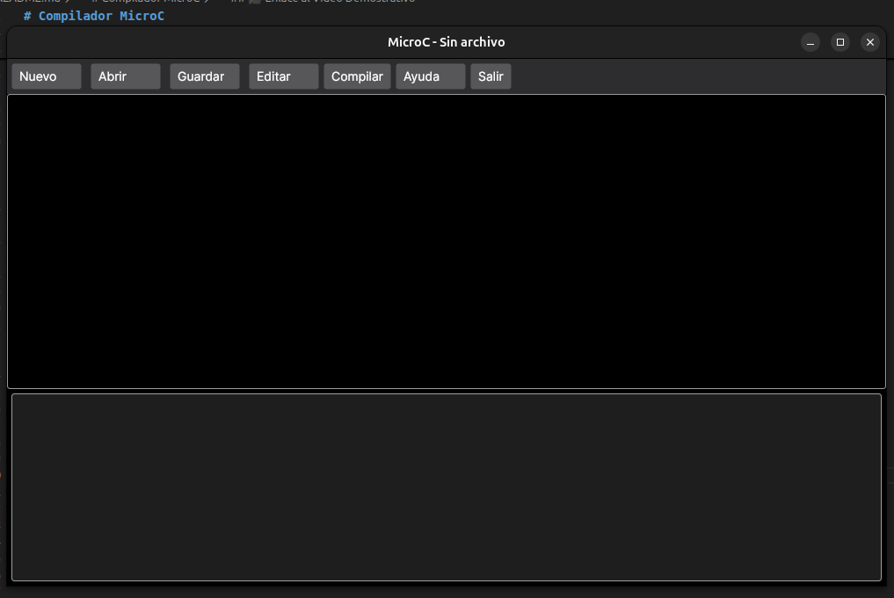
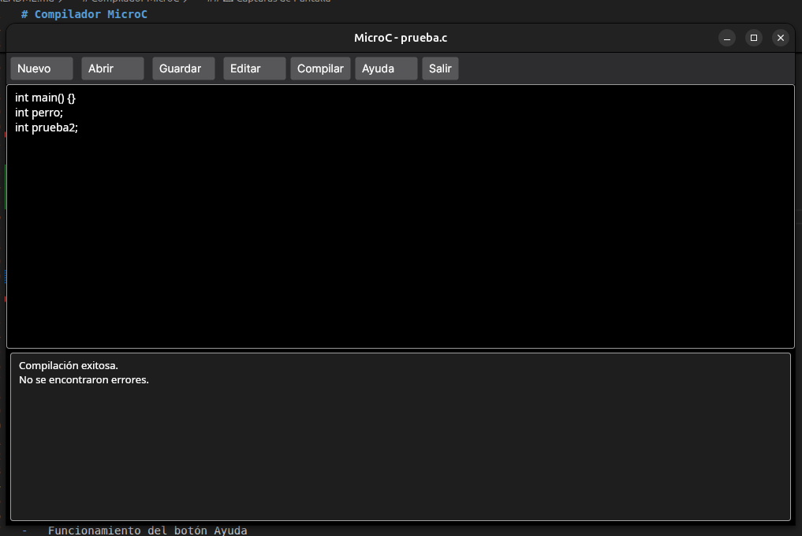
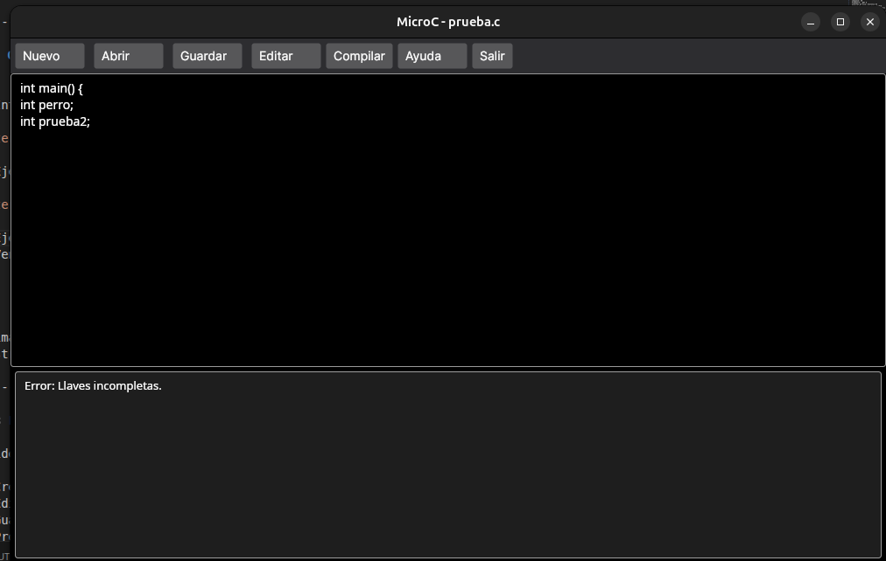
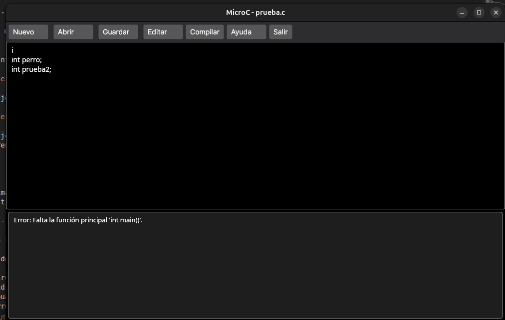
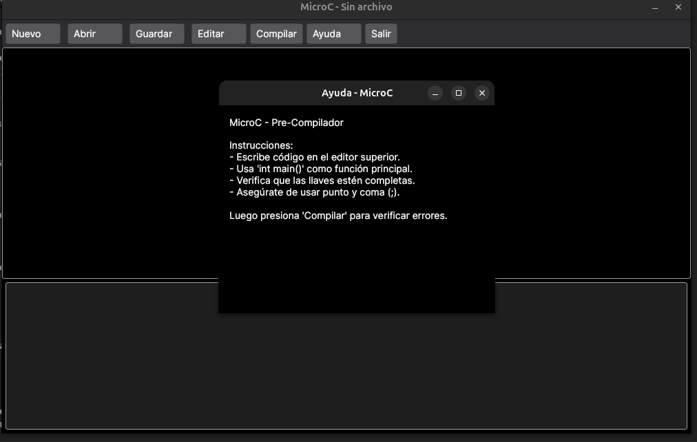

# Compilador MicroC

## 📌 Portada 

**Nombre completo:** Angel Hernández\
**Número de carné:** 202425514\
**Curso:** Autómatas y Lenguajes\
**Proyecto:** Compilador MicroC

------------------------------------------------------------------------

## 📖 Descripción del Proyecto

MicroC es un pre-compilador desarrollado en Avalonia .NET como proyecto
del curso de Autómatas y Lenguajes de la Universidad Mesoamericana.

El objetivo principal del proyecto es simular el funcionamiento básico
de un compilador para el lenguaje C. Actualmente implementa la Fase I
del analizador léxico, permitiendo al usuario escribir código, abrir
archivos existentes, guardar archivos y ejecutar el análisis léxico.

El sistema analiza el código ingresado y realiza:

-   Generación de lista de tokens
-   Identificación de lexemas simples
-   Relación de lexemas con su número de línea
-   Ignorar espacios en blanco, tabuladores y saltos de línea
-   Detección básica de errores léxicos

También incluye control de edición, confirmación de salida con cambios
sin guardar y ventana de ayuda integrada.

------------------------------------------------------------------------

## 🔎 Fase I — Analizador Léxico

La Fase I del proyecto procesa el código fuente carácter por carácter
para separar lexemas y clasificar cada token según su tipo. El resultado
del análisis registra la línea, el lexema encontrado, el número de token
y el tipo correspondiente.

Además, el sistema muestra el total de tokens generados y la cantidad de
errores léxicos detectados durante el recorrido del código fuente.

### Clases agregadas

-   `TokenLexico.cs`: representa cada token con los campos `Linea`,
    `Lexema`, `Token` y `Tipo`.
-   `UnidadesLexicas.cs`: contiene la tabla de símbolos y tokens
    reconocidos por el analizador.
-   `AnalizadorLexico.cs`: realiza el recorrido del código fuente y
    genera la lista de tokens.

### Tokens implementados

| Lexema | Token | Tipo |
|---|---:|---|
| ( | 75 | Símbolo |
| ) | 76 | Símbolo |
| { | 77 | Símbolo |
| } | 78 | Símbolo |
| [ | 79 | Símbolo |
| ] | 80 | Símbolo |
| , | 91 | Símbolo |
| ; | 92 | Símbolo |
| . | 93 | Símbolo |
| + | 100 | Símbolo |
| - | 101 | Símbolo |
| * | 102 | Símbolo |
| / | 103 | Símbolo |
| = | 104 | Símbolo |
| < | 105 | Símbolo |
| > | 106 | Símbolo |
| ! | 107 | Símbolo |
| & | 108 | Símbolo |
| `|` | 109 | Símbolo |
| Identificador | 300 | Identificador |
| Número | 301 | Número |
| Error léxico | -1 | ErrorLexico |

### Ejemplo de análisis léxico

```c
int main() {
    int x = 10;
    x = x + 1;
}
```

Salida resumida:

```text
Linea: 1    Lexema: int     Token: 300    Tipo: Identificador
Linea: 1    Lexema: main    Token: 300    Tipo: Identificador
Linea: 1    Lexema: (       Token: 75     Tipo: Simbolo
Linea: 1    Lexema: )       Token: 76     Tipo: Simbolo
Linea: 1    Lexema: {       Token: 77     Tipo: Simbolo
...
Total de tokens: 17
Errores léxicos: 0
```

------------------------------------------------------------------------

## 🛠 Tecnologías Utilizadas

-   Lenguaje: C#
-   Framework: .NET 8
-   Interfaz gráfica: Avalonia UI
-   Control de versiones: Git y GitHub
-   Sistema operativo de desarrollo: Linux

------------------------------------------------------------------------

## ▶ Instrucciones de Ejecución

### 🔹 Ejecutar desde el código fuente

1.  Abrir una terminal dentro de la carpeta del proyecto.
2.  Compilar el proyecto:

```{=html}
<!-- -->
```
    dotnet build src/MicroC.csproj

3.  Ejecutar el siguiente comando:

```{=html}
<!-- -->
```
    dotnet run --project src/MicroC.csproj

------------------------------------------------------------------------

### 🔹 Ejecutar versión compilada (Release)

1.  Navegar a la carpeta:

```{=html}
<!-- -->
```
    bin/Release/net8.0/linux-x64/publish/

2.  Ejecutar:

```{=html}
<!-- -->
```
    ./MicroC

También puede ejecutarse desde el acceso directo creado en el escritorio
(si aplica).

------------------------------------------------------------------------

## 🖼 Capturas de Pantalla


-   Interfaz principal del programa



-   Ejemplo de compilación exitosa



-   Ejemplo de error detectado





-   Ventana de ayuda




Las imágenes estan almacenadas en la carpeta `/assets/` según la estructura solicitada.

------------------------------------------------------------------------

## 🎥 Enlace al Video Demostrativo

El video demostrativo muestra:

-   Creación de archivo nuevo
-   Edición de código
-   Guardado de archivo
-   Ejecución del análisis léxico
-   Detección de errores léxicos
-   Funcionamiento del botón Ayuda

🔗 Enlace al video: https://youtu.be/8Fx_sU_dBjY

------------------------------------------------------------------------

## 📂 Estructura del Repositorio

El repositorio está organizado de la siguiente manera:

    /src/        → Código fuente de la aplicación
    /assets/     → Recursos como imágenes o íconos
    /docs/       → Documentación y capturas de pantalla
    /test/       → (Opcional) Archivos de prueba
    README.md    → Documentación principal del proyecto

------------------------------------------------------------------------

## 📄 Documentación

La documentación completa del proyecto, incluyendo el manual de usuario, descripción técnica y capturas de pantalla, se encuentra disponible en la carpeta /docs/ dentro de este repositorio.

En dicha carpeta se incluyen:

Manual de Usuario en formato Word (.docx)

Capturas de pantalla del sistema

Documentación complementaria del proyecto

## 🚀 Versión Final

Se publicó un Release final en GitHub con el tag:

v1.0-precompilador

Esta versión contiene el código funcional completo del pre-compilador
MicroC.

Actualización: se implementó la Fase I del analizador léxico. La Fase II
queda pendiente para completar palabras reservadas, números reales y
comentarios.
